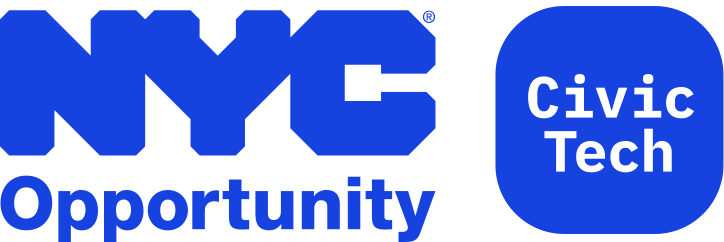

# ACCESS NYC Field Screener

The ACCESS NYC Field Screener is a tablet optimized version of the [ACCESS NYC benefits eligibility screener](https://access.nyc.gov/eligibility) created for outreach caseworkers. It is designed to be filled out for clients in-person or remotely during outreach sessions. The original source code can be found in [v3.12.0 of the ACCESS NYC code repository](https://github.com/CityOfNewYork/ACCESS-NYC/releases/tag/v3.12.0). It has been extracted, modified, and packaged into this plugin.

This code, similar to the original eligibility screener, relies on the program content and benefits screening API proxy inside the ACCESS NYC website in order to provide screening results to the client and caseworker.

## Installation using [Composer](https://getcomposer.org/)

**$1** This package uses [Composer Installers](https://github.com/composer/installers) to install the package in the **Must Use** plugins directory (*/wp-content/mu-plugins*):

```shell
composer require nyco/anyc-field-screener
```

### Autoload Backend

Copy the [autoloader sample](autoloader-sample.php) from the plugin directory into the must use plugin directory.

```shell
cp wp-content/mu-plugins/anyc-field-screener/autoloader-sample.php wp-content/mu-plugins/field-screener.php
```

Or, manually create a page template in the theme directory with the following snippet.

```
📄 /wp-content/mu-plugins/field-screener.php
```

Contents.

```php
<?php

/**
 * Plugin Name: NYCO ACCESS NYC Field Screener
 * Description: Autoloads the backend of the Field Screener application.
 * Author: NYC Opportunity
 */

$dir = WPMU_PLUGIN_DIR . '/anyc-field-screener';

if (file_exists($dir)) {
  include_once $dir . '/Auth.php';
  include_once $dir . '/Util.php';
  require_once $dir . '/Backend.php';

  new FieldScreener\Backend();
}
```

### Create Routes

Copy the [template sample](template-sample.php) from the plugin directory into the theme directory.

```shell
cp wp-content/mu-plugins/anyc-field-screener/template-sample.php wp-content/themes/access/field-screener.php
```

Or, manually create a page template in the theme directory with the following snippet.

```
📄 /wp-content/themes/access/field-screener.php
```

Contents.

```php
<?php

/**
 * Template name: Field Screener
 */

$dir = WPMU_PLUGIN_DIR . '/anyc-field-screener';

if (file_exists($dir)) {
  require_once $dir . '/Views.php';

  new FieldScreener\Views();

  $post = Timber::get_post();

  echo do_shortcode($post->post_content);
}
```

*Optional*. A single template will suffice but there are two view routes for the application. The first is a root view and the second is a nested result view. It is possible to use WordPress's page template slug system to create two templates

```
📄 page-field-screener.php
📄 page-results.php
```

### Add Pages

Add a new page and title it "Field Screener". Then, select the "Field Screener" as a page template and add a shortcode to the post content.

```
[anyc-field-screener]
```

This will render the application's root view at the route */field-screener*. Publish the page, then create another page for the results route. It can be titled "Results - Field Screener" but the page slug needs to be *results*. Select the "Field Screener" as a page template and add a shortcode to the post content.

```
[anyc-field-screener page="results"]
```

The `page="results"` attribute designates the view as the results page. This will render the application's results view at the route */field-screener/results*.

Publish the results page. The application will be viewable at */field-screener*.

## Shortcode Attributes

In addition to `page`. There are other shortcode attributes that can be set to customize the location and environment of the application.

Attribute       | Default Value                                | Description
----------------|----------------------------------------------|-
`env`           | *See below*                                  | The human readable environment string used in the environment alert to inform users which environment they are viewing.
`productionUrl` | https://access.nyc.gov/eligibility/          | This is the application link the environment alert will link users to when the environment's `WP_ENV` is not set to the production value, `accessnyc`.
`assets`        | /wp-content/mu-plugins/field-screener/assets | The path to the application's static assets.
`root`          | /field-screener/                             | The root slug of the application. This should match the WordPress page slug.
`results`       | /field-screener/results/                     | The root slug and results slug for the application. This determines the redirect path from the main screening application to the results page. If the root is changed, this will need to be changed as well. This should match the WordPress page slug.
`resultsShare`  | /eligibility/results/                        | The root slug and results slug for the results page that is shared with users when they text or email results to themselves. This path replaces the `results` path defined above.
`translationID` | field-screener                               | The string translation template location ID. This is used to scope translations for the application.
`page`          | screener                                     | Can be set to `results` to designate the results route.

## Environment string defaults

The env string is determined by the `WP_ENV` constant value. This constant is set in the various environments of the ACCESS NYC site. If the constant isn't defined the string will default to "Unknown."

`WP_ENV` Value  | String
----------------|-
`accessnyc`     | "Production"
`accessnycs`    | "Staging"
`accessnycdemo` | "Demo"
`accessnyctest` | "Testing"
`development`   | "Development"

## Debugging

Add the `?debug=1` query parameter to the URL to see application logs. This will display data values set to the household model, form validation warnings, and the screening API request object and responses. Set "Preserve Log" to true to retain the response from the application to the results page.

The network panel will also reveal the API request and response information.

---

<p></p>

[The Mayor's Office for Economic Opportunity](http://nyc.gov/opportunity) (NYC Opportunity) is committed to sharing open source software that we use in our products. Feel free to ask questions and share feedback. **Interested in contributing?** See our open positions on [buildwithnyc.github.io](http://buildwithnyc.github.io/). Follow our team on [Github](https://github.com/orgs/CityOfNewYork/teams/nycopportunity) (if you are part of the [@cityofnewyork](https://github.com/CityOfNewYork/) organization) or [browse our work on Github](https://github.com/search?q=nycopportunity).
