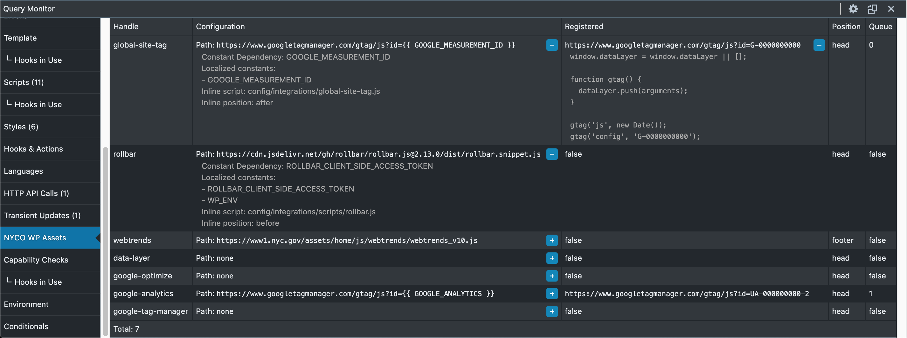

# NYCO WordPress Assets

A developer plugin with helpers for managing assets in WordPress. It can be used to register and enqueue stylesheets with general defaults and hashed names as well as configure inline integrations such as Google Analytics, Rollbar, etc by using WordPress' native `wp_enqueue/register_style/script()` and `wp_add_inline_script()` methods. This properly loads them into the site, avoids conflicts, and exposes them to asset hooks for deeper configuration.

* [Installation](#installation-using-composer)
* [Usage](#usage)
* [Documentation](#documentation)
* [Query Monitor Add-on](#query-monitor-add-on)

## Installation using [Composer](https://getcomposer.org/)

**$1** This package uses [Composer Installers](https://github.com/composer/installers) to install the package in the **Must Use** plugins directory (*/wp-content/mu-plugins*):

    composer require nyco/wp-assets

*Not using Composer?* Download an archive of the code and drop it into the mu-plugins directory.

**$2** [Create a proxy PHP loader file](https://wordpress.org/support/article/must-use-plugins/#caveats) inside the mu-plugins directory, or [use the one included with the plugin](https://github.com/CityOfNewYork/nyco-wp-assets/blob/master/autoloader-sample.php):

    mv wp-content/mu-plugins/wp-assets/autoloader-sample.php wp-content/mu-plugins/wp-assets.php

## Usage

**Quickstart**. Declare namespace in **functions.php** (or any php file) and instantiate.

    use NYCO\WpAssets as WpAssets;

    $WpAssets = new WpAssets();

    // The general pattern for all methods is $WpAssets->{{ method }}()
    $WpAssets->addScript();

**Migrating** a block such as this...

    wp_register_script('main', '/wp-content/themes/theme/assets/js/main.831f1593.js', [], null, true);
    wp_enqueue_script('main');

... can be done with...

    $WpAssets->addScript('main');

Assuming `main.831f1593.js` is a compiled script file and `831f1593` is a hash based on the contents of the script, the filename will change if the contents of the file change. This is useful for cache busting without forcing a browser to load the script on every load using a query variable `?ver=831f1593`. However, WordPress won't be able to locate scripts without a hard-coded source. `->addScript('main')` will register and enqueue the first script file it finds with any hash contents between `main.` and `.js`.

**Note**. The autoloader sample sets an instance of `WpAssets` to the global scope which can be used as well;

    $GLOBALS['wp_assets']->addScript();

## Documentation

The core of the plugin is a single class with several methods that are available upon instantiation. For a full description of methods refer to the [source](https://github.com/CityOfNewYork/nyco-wp-assets/blob/master/WpAssets.php).

### Class (including namespace)

    NYCO\WpAssets

### Methods

* [Add Script](#add-script)
* [Add Style](#add-style)
* [Add Attribute](#add-attr)
* [Load Integrations](#load-integrations)
* [Add Inline](#add-inline)
* [Register Rest Routes](#register-rest-routes)

### Add Script

    ->addScript( ...args )

Register and/or enqueue a hashed script based on it's name. File name should match the pattern `script.{{ hash }}.js` by default. The separator between the filename and the hash can be configured.

**...args**

- `String   $handle`    The name of the file without a hashname. Default: `'scripts'`
- `Boolean  $enqueue`   Wether to enqueue the file or not. Default: `true`
- `Array    $deps`      Maps to [`wp_register`](https://developer.wordpress.org/reference/functions/wp_register_script/)|[`enqueue_script`](https://developer.wordpress.org/reference/functions/wp_enqueue_script/) `$deps` argument. Default: `array()`
- `String   $ver`       Maps to [`wp_register`](https://developer.wordpress.org/reference/functions/wp_register_script/)|[`enqueue_script`](https://developer.wordpress.org/reference/functions/wp_enqueue_script/) `$ver` argument. Default: `null`
- `Boolean  $in_footer` Maps to [`wp_register`](https://developer.wordpress.org/reference/functions/wp_register_script/)|[`enqueue_script`](https://developer.wordpress.org/reference/functions/wp_enqueue_script/) `$in_footer` argument. Default: `true`
- `String   $sep`       The separator between the base name and the hash. Default: `'.'`

**Returns** Key/value pair including [wp_register_script](https://developer.wordpress.org/reference/functions/wp_register_script/) response, [wp_enqueue_script](https://developer.wordpress.org/reference/functions/wp_enqueue_script/) response, and the source uri of the file.

#### Examples

    $WpAssets->addScript();

This will scan the default scripts assets directory *assets/scripts/* of the current theme using the default pattern *script.{{ hash }}.js*, register the script with the handle `script` and enqueue it. To pick a different script named *main.{{ hash }}.js* do the following;

    $WpAssets->addScript('main');

This script will be loaded into the footer of the document and be available to the [script_loader_tag filter](https://developer.wordpress.org/reference/hooks/script_loader_tag/);

    add_filter('script_loader_tag', function($tag, $handle) {
      if ($handle === 'main') {
        // do something to $tag like add attributes, disable for certain views, etc.
      }

      return $tag;
    });

[Back to top](#documentation)

---

### Add Style

    ->addStyle( ...args )

Register and/or enqueue a hashed style based on it's name. File name should match the pattern `styles.{{ hash }}.css`. The separator between the filename and the hash can be configured.

**...args**

- `String   $handle`   The name of the file without a hashname. Default: `'styles'`
- `Boolean  $enqueue`  Wether to enqueue the file or not. Default: `true`
- `Array    $deps`     Maps to [`wp_register`](https://developer.wordpress.org/reference/functions/wp_register_style/)|[`enqueue_style`](https://developer.wordpress.org/reference/functions/wp_enqueue_style/) `$deps` args. Default: `array()`
- `String   $ver`      Maps to [`wp_register`](https://developer.wordpress.org/reference/functions/wp_register_style/)|[`enqueue_style`](https://developer.wordpress.org/reference/functions/wp_enqueue_style/) `$ver` args. Default: `null`
- `String   $media`    Maps to [`wp_register`](https://developer.wordpress.org/reference/functions/wp_register_style/)|[`enqueue_style`](https://developer.wordpress.org/reference/functions/wp_enqueue_style/) `$media` args. Default: `'all'`
- `String   $sep`      The separator between the base name and the hash. Default: `'.'`

**Returns** Key/value pair including [wp_register_style](https://developer.wordpress.org/reference/functions/wp_register_style/) response, [wp_enqueue_style](https://developer.wordpress.org/reference/functions/wp_enqueue_style/) response, and the source uri of the file.

#### Examples

    $WpAssets->addStyle();

This will scan the default style assets directory *assets/styles/* of the current theme using the default pattern *style.{{ hash }}.css*, register the style with the handle `style` and enqueue it. To pick a different style named *site.{{ hash }}.css* do the following;

    $WpAssets->addStyle('site');

[Back to top](#documentation)

---

### Add Attr

    ->addAttr( ...args )

Uses the [`script_loader_tag`](https://developer.wordpress.org/reference/hooks/script_loader_tag/) filter to add an attribute and a value to a specific script. For example; crossorigin="anonymous". 
Attribute values may be strings. To add a boolean attribute such as `async` or `defer` pass `true`."

**...args**

- `String  $name`  The name of the script.
- `String  $attr`  The name of the attribute.
- `String|Boolean $value` The value set for the attribute.

#### Examples

    $WpAssets->addAttr('script', 'async', true);

[Back to top](#documentation)

---

### Load Integrations

    ->loadIntegrations( ...args )

This retrieves an integration configuration file from the MU Plugins directory. By default it will look for a YAML file at *config/integrations.yml* that contains an array of individual configuration objects then it converts the YAML file to a PHP Array and returns it. This is meant to be used with the `->enqueueInline( ...args )` method.

**...args**

- `String  $path` Accepts a custom to the integrations file within the Must Use Plugins directory. Default `'config/integrations.yml'`

**Returns** an array of individual configuration objects.

    $integrations = $WpAssets->loadIntegrations();

A configuration file may include multiple objects with the following parameters.

    - handle: rollbar
      path: https://remote/url/to/integration/source.js
      dep: CONSTANT_THIS_SCRIPT_IS_DEPENDENT_ON
      localize:
        - ARRAY_OF_CONSTANTS_TO_LOCALIZE_IN_SCRIPT
        - CONSTANT_MY_SCRIPT_IS_DEPENDENT_ON
      in_footer: true/false
      inline:
        path: config/integrations/scripts/a-config-script-for-the-source.js
        position: before
      body_open:
        path: config/integrations/body/a-html-tag-to-include-in-the-body.html
      attrs:
        crossorigin: 'anonymous'
        async: true

    - handle: google-analytics
      path: https://www.googletagmanager.com/gtag/js?id={{ GOOGLE_ANALYTICS }}
      dep: GOOGLE_ANALYTICS
      localize:
        - GOOGLE_ANALYTICS
      in_footer: false
      inline:
        path: config/integrations/scripts/google-analytics.js
        position: after

[Back to top](#documentation)

---

### Add Inline

    ->addInline( ...args )

Register and enqueue inline scripts and their source using `wp_register/enqueue_script()` and [`wp_add_inline_script()`](https://developer.wordpress.org/reference/functions/wp_add_inline_script/)

Useful for cloud service integrations that are configured on the client-side (Google Analytics, Webtrends, Rollbar.js, etc.) what require loading a remote source but are configured with an inline script code block.

Also enqueues inline styles if required by the configuration. This is not possible by default and uses a technique described in [this article](https://www.cssigniter.com/late-enqueue-inline-css-wordpress/).

**...args**

- `Array  $script` Accepts a single key/value array of a configuration. Refer to the `->loadIntegrations( ...args )` method.

**Returns** the same array with additional inline script contents.

#### Examples

    $integrations = $WpAssets->loadIntegrations();

    if ($integrations) {
      $index = array_search('google-analytics', array_column($integrations, 'handle'));

      $WpAssets->addInline($integrations[$index]);
    }

This will load the `'google-analytics'` integration. Below is the Google Analytics configuration in *config/integrations.yml*...

    - handle: google-analytics
      path: https://www.googletagmanager.com/gtag/js?id={{ GOOGLE_ANALYTICS }}
      dep: GOOGLE_ANALYTICS
      localize:
        - GOOGLE_ANALYTICS
      in_footer: false
      inline:
        path: config/integrations/scripts/google-analytics.js
        position: after
      attrs:
        async: true

The *config/integrations/scripts/google-analytics.js* script should contain something like the following;

    function gtag() { dataLayer.push(arguments); }
    gtag('js', new Date());
    gtag('config', '{{ GOOGLE_ANALYTICS }}');

The constant `GOOGLE_ANALYTICS` should be defined somewhere in another part of your configuration (*wp-config.php*, *functions.php*, *or* this plugin workes nicely with the [nyco-wp-config](https://github.com/CityOfNewYork/nyco-wp-config) plugin);

    define('GOOGLE_ANALYTICS', 'GTM-9A9A9A9');

The following will be printed in the head of the document;

    

[Back to top](#documentation)

---

### Register Rest Routes

    ->registerRestRoutes( ...args )

Uses an array of configuration objects to register WP Rest Routes that act as JavaScript files instead of inline scripts.

**...args**

- `Array  $scripts` Array of integration objects (use ->loadIntegrations() to retrieve them).
- `Function  $auth` The authentication function to use for routes (passed to register_rest_route() as the `'permission_callback'` argument).

**Returns** the Array of integrations objects with all rest route details.

[Back to top](#documentation)

## Query Monitor Add-on

This plugin ships with an add-on for [Query Monitor](https://querymonitor.com/) that displays the *available* integrations to the [Load Integrations method](#load-integrations) and compares them to integrations that are registered. It uses the same method to display the details of the **config/integrations.yml** file.

---

[The Mayor's Office for Economic Opportunity](http://nyc.gov/opportunity) (NYC Opportunity) is committed to sharing open source software that we use in our products. Feel free to ask questions and share feedback. **Interested in contributing?** See our open positions on [buildwithnyc.github.io](http://buildwithnyc.github.io/). Follow our team on [Github](https://github.com/orgs/CityOfNewYork/teams/nycopportunity) (if you are part of the [@cityofnewyork](https://github.com/CityOfNewYork/) organization) or [browse our work on Github](https://github.com/search?q=nycopportunity).
