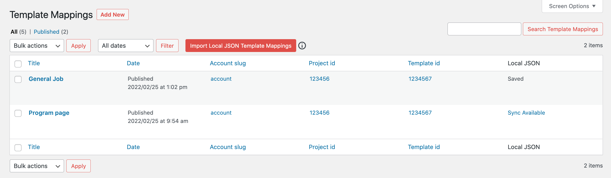
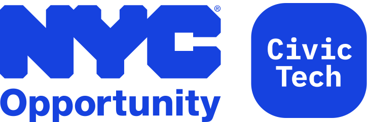

# NYCO WordPress Gather Content Templates Sync

A developer plugin for WordPress that saves template mappings created by the [Gather Content WordPress integration](https://wordpress.org/plugins/gathercontent-import/) to local JSON files. These files can be tracked for migration to other environments. It provides an alternative to [migrating template mappings from local development to other environments](https://help.gathercontent.com/en/articles/119150-wordpress-integration-faqs-frequently-asked-questions#is-there-a-way-to-export-your-mapping-settings-so-you-can-import-them-from-your-local-computer-to-your-development-server) using the behavior and experience of [Advanced Custom Fields (ACF) Local JSON](https://www.advancedcustomfields.com/resources/local-json/).



## Installation using [Composer](https://getcomposer.org/)

**$1** This package uses [Composer Installers](https://github.com/composer/installers) to install the package in the **Must Use** plugins directory (*/wp-content/mu-plugins*):

```shell
composer require nyco/wp-gc-templates-sync
```

**$2** [Create a proxy PHP loader file](https://wordpress.org/support/article/must-use-plugins/#caveats) inside the mu-plugins directory, or [use the one included with the plugin](autoloader-sample.php):

```shell
mv wp-content/mu-plugins/wp-gc-templates-sync/autoloader-sample.php wp-content/mu-plugins/wp-gc-templates-sync.php
```

> *Not using Composer?* Download an archive of the code and drop it into the mu-plugins directory. The plugin file will still need to be required and instantiated by an autoloader in the root of the mu-plugins directory.

## Usage

Once activated, the plugin will add a "Local JSON" column to the Template Mappings Post list in the WordPress admin. It will display one of three sync statuses for each template mapping; "Awaiting Save," "Saved," or "Sync Available."

The default status is "Awaiting Save." As template mappings are created or modified the plugin will write changes to local JSON to the theme directory under **gc-templates**. Once the local JSON is written, the status will change to "Saved." The local JSON can then be tracked and committed along with the rest of the theme code.

### Migrate Template Mappings

Once the local JSON and plugin is deployed to a remote environment the button "Import Local JSON Template Mappings" will appear above the template mapping table list. It will only appear if the items in the local JSON are not detected in the environment's database. Clicking the button will import them.

### Syncing Additional Changes

If additional changes are made to the same template mappings locally and deployed to the remote environment the Local JSON column status will change to a link that says "Sync Available." Clicking this link will update the remote environment's template mapping with the data from the local JSON file.

### Notes

* The synchronization key for template mappings is the Gather Content project template ID. There can only be one template mapping per Gather Content project template.

* The "Sync Available" status appears when the local JSON modified date is greater than the template mapping modified date in the database. This means an older local JSON file cannot be synced with a remote template mapping that was modified at a later date.

* The local JSON template mappings need to be synchronized in order to take effect.

### Contributing

Clone repository and create a feature branch. Make changes and run `composer run lint` to follow the coding specification. `composer run fix` can help fix some of the issues.

---

<p></p>

[The Mayor's Office for Economic Opportunity](http://nyc.gov/opportunity) (NYC Opportunity) is committed to sharing open source software that we use in our products. Feel free to ask questions and share feedback. **Interested in contributing?** See our open positions on [buildwithnyc.github.io](http://buildwithnyc.github.io/). Follow our team on [Github](https://github.com/orgs/CityOfNewYork/teams/nycopportunity) (if you are part of the [@cityofnewyork](https://github.com/CityOfNewYork/) organization) or [browse our work on Github](https://github.com/search?q=nycopportunity).