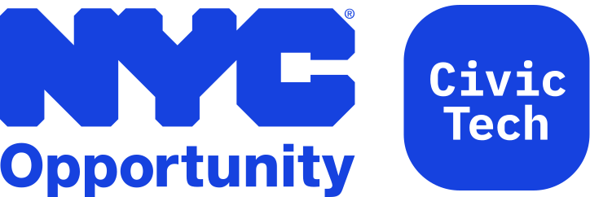

# NYCO WordPress Login

...

## Installation using [Composer](https://getcomposer.org/)

**$1** This package uses [Composer Installers](https://github.com/composer/installers) to install the package in the **Must Use** plugins directory (*/wp-content/mu-plugins*). Be sure to require it as a development package:

```shell
composer require nyco/wp-login -D
```

**$2** Prevent the plugin from being committed to the repository by adding it to .gitignore

```gitignore
/wp-content/mu-plugins/wp-login/*
```

> *Not using Composer?* Download an archive of the code and drop it into the mu-plugins directory. The plugin file will still need to be required and instantiated by an autoloader in the root of the mu-plugins directory.

## Usage

...

### Contributing

Clone repository and create a feature branch. Make changes and run `composer run lint` to follow the coding specification. `composer run fix` can help fix some of the issues.

---

<p></p>

[The Mayor's Office for Economic Opportunity](http://nyc.gov/opportunity) (NYC Opportunity) is committed to sharing open source software that we use in our products. Feel free to ask questions and share feedback. **Interested in contributing?** See our open positions on [buildwithnyc.github.io](http://buildwithnyc.github.io/). Follow our team on [Github](https://github.com/orgs/CityOfNewYork/teams/nycopportunity) (if you are part of the [@cityofnewyork](https://github.com/CityOfNewYork/) organization) or [browse our work on Github](https://github.com/search?q=nycopportunity).