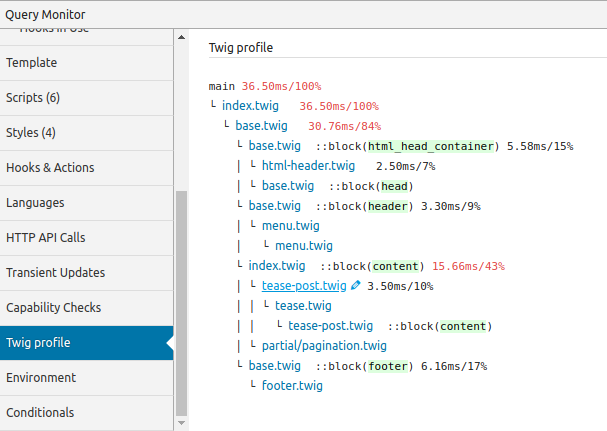

# Query monitor Twig profile

[](https://github.com/NielsdeBlaauw/query-monitor-twig-profile/actions)
[](https://wordpress.org/plugins/query-monitor-twig-profile/)
[](https://github.com/johnbillion/query-monitor)

**Query Monitor Twig profile is available in the [WordPress plugin repository](https://wordpress.org/plugins/query-monitor-twig-profile/)**.

Displays [Twig](https://twig.symfony.com/) profiler output in [Query Monitor](https://github.com/johnbillion/query-monitor).

Automatically works with [Timber](https://github.com/timber/timber).




## Description

Find out which pages are slow, and why! Immediately see profiling information from Twig in your Query Monitor toolbar.

Automatically integrates with Timber.

- Support for dark mode.
- Clickable links to profiled templates in your preferred editor.
- Downloadable blackfire.io profiles.
- History mode. Save profiles so you can see the impact of your changes.

## Installation

1. Install the plugin
2. Activate it
3. Check the 'Twig profile' tab in Query Monitor
4. Optimize your site

## Frequently Asked Questions

### Can I use it with other frameworks that use Twig?

Definitely. Just add a Twig profiler extension to your Twig instance and submit it to the collector.

```php
if ( function_exists( 'NdB\QM_Twig_Profile\collect' ) ) {
	$twig = \NdB\QM_Twig_Profile\collect( $twig );
}
```

## Development

Test the GitHub Actions workflow with [act](https://github.com/nektos/act):

See the documentation for the [setup-php action](https://github.com/marketplace/actions/setup-php-action#local-testing-setup)

```shell
act -P ubuntu-latest=shivammathur/node:latest
```
